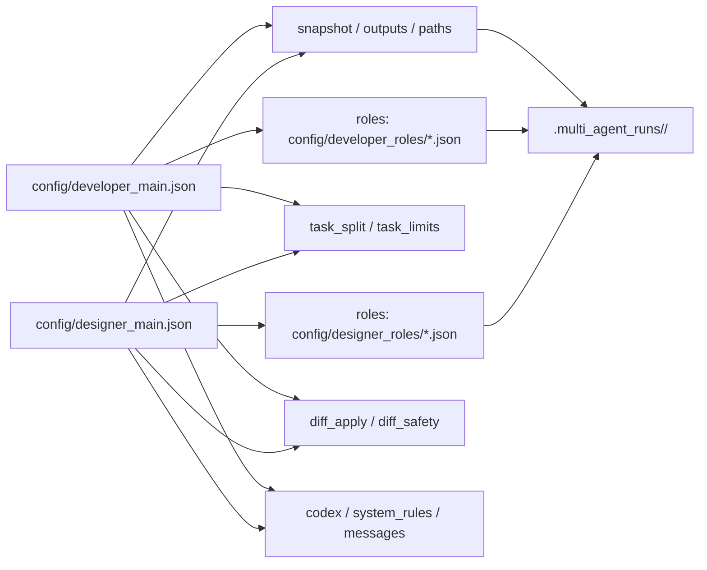

# Multi-Agent Codex CLI Orchestrator

## Überblick
Dieses Projekt stellt ein vollständiges Python-basiertes Multi-Agent-System dar,
das mithilfe der **Codex CLI** mehrere spezialisierte Agenten parallel oder sequentiell
auf eine Software-Entwicklungsaufgabe ansetzt.

### Enthaltene Agenten
- **Architect** – entwirft Architektur & Plan
- **Implementer** – implementiert Features (liefert Unified Diff)
- **Tester** – erzeugt Tests
- **Reviewer** – Code-Review & Fixes
- **Integrator** – finaler Merge & Zusammenfassung

## Voraussetzungen
- Python **3.10+**
- Codex CLI im PATH
- Optional: Git (für robustes Patch-Handling)

## Installation
```bash
git clone <repo>
cd <repo>
python multi_agent_codex.py --task "Deine Aufgabe"
```

## Quickstart
Minimaler Lauf (ohne Patch-Apply):
```bash
python multi_agent_codex.py --task "Analysiere Modul X"
```
Ohne Patch-Apply bedeutet: Es werden keine Dateien im Workspace veraendert. Die Agenten schreiben nur Outputs/Diffs in `.multi_agent_runs/<timestamp>/`.

Task aus Datei (empfohlen fuer lange Aufgaben):
```bash
python multi_agent_codex.py --task "@implementierer.md"
```
Das `@` vor dem Pfad bedeutet: Der Task wird aus einer Datei geladen. `implementierer.md` ist nur ein Beispielname; jeder Pfad ist moeglich.
Du nutzt `@pfad` nur dann, wenn du den Task nicht inline schreiben willst, sondern aus einer Datei laden moechtest (z.B. sehr lange Beschreibung, versionierbare Aufgaben, mehrere Abschnitte).

Patch-Apply ausfuehren (Aenderungen in den Workspace schreiben):
```bash
python multi_agent_codex.py --task "@implementierer.md" --apply
```
`--apply` nimmt die von den Rollen erzeugten Unified Diffs und wendet sie auf den Workspace an. Optional kannst du mit `--apply-confirm` jeden Diff bestaetigen. Mit `--apply-mode role` werden Diffs sofort nach jeder Rolle angewendet (sonst am Ende).

Task-Splitting ueber Ueberschriften (mehrere Runs):
```bash
python multi_agent_codex.py --task "@implementierer.md" --task-split
```
Ob gesplittet wird, steuert `task_split.decision_mode` in `config/developer_main.json` (`auto` oder `always`).
Standard ist `config/developer_main.json` (mit `--config` kannst du eine andere Datei waehlen, z.B. `config/designer_main.json`).

### Wann benutze ich `@pfad`?
- **Ohne @**: kurze, einfache Aufgaben direkt im CLI (inline).
  ```bash
  python multi_agent_codex.py --task "Baue Feature X"
  ```
- **Mit @**: lange Aufgaben aus einer Datei laden.
  ```bash
  python multi_agent_codex.py --task "@tasks/feature_x.md"
  ```
- **Wichtig**: Die Task-Datei erstellst du selbst. Sie wird **nicht** automatisch erzeugt.
- Agent-Outputs liegen unter `.multi_agent_runs/` (z.B. `implementer_1.md`) und sind **nicht** dasselbe wie eine Task-Datei.
- `@pfad` ist ein normaler Dateipfad (relativ zum Arbeitsverzeichnis oder absolut). Wenn die Datei fehlt, bricht der Lauf mit Fehler ab.
- **Kein Pflicht-Format**: Die Task-Datei kann beliebiger Text/Markdown sein. Ueberschriften helfen nur beim automatischen Splitten.

Optionales Template (nur Empfehlung, kein Muss):
```md
# Titel
## Ziel
- Was soll erreicht werden?

## Anforderungen
- Punkt 1
- Punkt 2

## Akzeptanzkriterien
- Kriterium 1
- Kriterium 2

## Hinweise
- Relevante Dateien/Module
- Randbedingungen
```

Beispiel ohne Template (trotzdem gueltig):
```text
Bitte baue ein Feature, das CSV-Importe erlaubt.
Die Datei kommt per Upload und soll validiert werden.
Fehler muessen klar im API-Response erscheinen.
Tests fuer Import + Validierung sind Pflicht.
```

Beispiel fuer eine Task-Datei (`tasks/feature_x.md`):
```bash
mkdir -p tasks
cat > tasks/feature_x.md <<'EOF'
# Feature X
- Ziel: API-Endpoint /v1/items
- Anforderungen:
  - GET /v1/items mit Pagination
  - POST /v1/items mit Validierung
  - Tests fuer beide Endpoints
EOF
```
Inhalt der Datei (`tasks/feature_x.md`):
```text
# Feature X
- Ziel: API-Endpoint /v1/items
- Anforderungen:
  - GET /v1/items mit Pagination
  - POST /v1/items mit Validierung
  - Tests fuer beide Endpoints
```
Ausfuehren mit Datei-Task:
```bash
python multi_agent_codex.py --task "@tasks/feature_x.md"
```
Design-Rollen verwenden (UI-Rollen):
```bash
python multi_agent_codex.py --config config/designer_main.json --task "@tasks/feature_x.md"
```
Erwartete Artefakte (pro Run):
- `config/developer_main.json` (oder `config/designer_main.json`) steuert, welche Rollen laufen.
- `config/developer_roles/*.json` bzw. `config/designer_roles/*.json` enthalten die Rollen-Prompts.
- `.multi_agent_runs/<timestamp>/` mit `*.md` Outputs und `snapshot.txt`.

## Nutzung
```bash
python multi_agent_codex.py \
  --task "Baue ein CRUD mit FastAPI" \
  --dir . \
  --apply
```

## Wichtige Flags
### multi_agent_codex.py
| Flag | Beschreibung |
|-----|--------------|
| --config | Pfad zur Konfigurationsdatei (z.B. `config/developer_main.json`) |
| --task | Zentrale Aufgabe (Pflicht). Optional: `@pfad` fuer Task-Datei |
| --dir | Arbeitsverzeichnis/Repo-Root (default: current dir) |
| --timeout | Timeout pro Agent in Sekunden |
| --apply | Versucht Diffs aus Agent-Outputs auf Workspace anzuwenden |
| --apply-mode | Wann Diffs angewendet werden: end (nach allen Rollen) oder role (nach jeder Rolle) |
| --apply-roles | Welche Rollen angewendet werden (repeatable oder kommasepariert) |
| --fail-fast | Bei Patch-Fehler sofort abbrechen (nur mit --apply) |
| --ignore-fail | Exitcode immer 0, auch wenn Agenten fehlschlagen |
| --task-split | Splittet die Aufgabe nach Ueberschriften und startet mehrere Runs |
| --no-task-resume | Deaktiviert Resume fuer Task-Splitting (neu aufsetzen) |
| --max-files | Max Dateien im Snapshot |
| --max-file-bytes | Max Bytes pro Datei im Snapshot |

### multi_role_agent_creator.py
| Flag | Beschreibung |
|-----|--------------|
| --description | Beschreibung fuer die Rolle (Pflicht) |
| --id | Rollen-ID (default: aus Beschreibung generiert) |
| --name | Anzeigename (default: id) |
| --role | Rollenlabel (default: name) |
| --title | Titel im Prompt (default: role) |
| --context | Zus. Platzhalter (key oder key:Label) |
| --apply-diff | Markiert Rolle als Diff-Lieferant |
| --insert-after | Fuegt Rolle nach einer Rolle ein |
| --config | Pfad zu `config/developer_main.json` (oder `config/designer_main.json`) |
| --force | Ueberschreibt vorhandene Rolle/Datei |

## Struktur
```text
.multi_agent_runs/
  └── TIMESTAMP/
      ├── task_board.json
      ├── coordination.log
      ├── architect_1.md
      ├── implementer_1.md
      ├── implementer_2.md
      ├── tester_1.md
      ├── reviewer_1.md
      └── integrator_1.md
```

## JSON Konfiguration
`config/developer_main.json` (oder `config/designer_main.json`) ist die zentrale Steuerdatei. Hier definierst du Rollen, Reihenfolge, Limits und das Verhalten beim Patch-Apply.

### Uebersicht (Struktur)


### Wichtige Bereiche (kurz)
- **roles**: Reihenfolge und Auswahl der Rollen, inkl. `instances`, `depends_on`, `apply_diff`.
- **task_split**: Task-Splitting ueber Ueberschriften und Hybrid-Planung.
  - `decision_mode`: `auto` (split nur wenn noetig) oder `always` (immer splitten).
  - `llm_enabled`/`llm_cmd`: LLM-Planer aktivieren und optionalen Codex-Command setzen.
- **task_limits**: Laengen-Limits fuer Tasks (Inline/Short/Dateiname).
- **snapshot**: Umfang des Workspace-Snapshots (Skip-Listen, Groessen, Delta).
- **outputs/paths**: Output-Pattern und Run-Verzeichnisse.
- **diff_apply/diff_safety**: Patch-Apply und Blocklisten/Allowlists.
- **codex/system_rules/messages**: CLI-Command, Systemregeln und Meldungen.

### Rollen: `config/developer_roles/*.json` und `config/designer_roles/*.json`
Jede Rolle ist eine eigene JSON-Datei mit:
- `id`: Rollen-ID (muss zur gewaehlten Hauptdatei passen).
- `name`: Name des Agents (default: id).
- `role`: Rollenbezeichnung fuer die Ausgabe.
- `prompt_template`: Prompt-Template mit Platzhaltern wie `{task}`, `{snapshot}`,
  `{architect_summary}`, `{implementer_summary}`, `{tester_summary}` oder
  `{<rolle>_output}`.
In der jeweiligen Hauptdatei pro Rolle zusaetzlich:
- `instances`: Anzahl paralleler Instanzen (default: 1).

Beispiel: UI-Rollen (Auszug aus `config/designer_main.json`)
```json
"roles": [
  { "id": "ui_architect", "file": "designer_roles/ui_architect.json", "instances": 1 },
  { "id": "ui_designer", "file": "designer_roles/ui_designer.json", "instances": 1, "depends_on": ["ui_architect"] },
  { "id": "ui_implementer", "file": "designer_roles/ui_implementer.json", "apply_diff": true, "depends_on": ["ui_designer"] },
  { "id": "ui_tester", "file": "designer_roles/ui_tester.json", "apply_diff": true, "depends_on": ["ui_implementer"] },
  { "id": "ui_reviewer", "file": "designer_roles/ui_reviewer.json", "apply_diff": true, "depends_on": ["ui_tester"] },
  { "id": "ui_implementer_revision", "file": "designer_roles/ui_implementer_revision.json", "apply_diff": true, "depends_on": ["ui_reviewer"], "run_if_review_critical": true },
  { "id": "ui_integrator", "file": "designer_roles/ui_integrator.json", "depends_on": ["ui_architect","ui_designer","ui_implementer","ui_tester","ui_reviewer","ui_implementer_revision"] }
],
"final_role_id": "ui_integrator"
```

### Standard-Platzhalter
In jedem `prompt_template` verfuegbar:
- `{task}`: Globale Aufgabe.
- `{snapshot}`: Workspace-Snapshot.
- `{task_board_path}`: Pfad zum Task-Board (JSON).
- `{coordination_log_path}`: Pfad zum Koordinations-Log (JSONL).
- `{role_instance_id}` / `{role_instance}`: Instanz-Infos fuer parallele Rollen.
- `{<rolle>_summary}`: Kurz-Zusammenfassung der Rolle (z.B. `{architect_summary}`).
- `{<rolle>_output}`: Voller Output der Rolle (z.B. `{reviewer_output}`).

## Rollen-Ablauf
- Rollen laufen sequentiell in der Reihenfolge der gewaehlten Hauptdatei.
- `apply_diff: true` markiert Rollen, deren Diffs bei `--apply` angewendet werden.
- `--apply-mode role` wendet Diffs direkt nach der Rolle an und erzeugt einen frischen Snapshot.
- Die finale Kurz-Ausgabe stammt von `final_role_id`.

### Rollen-Abhaengigkeiten (Mermaid)


## Parallelisierung pro Rolle
- `roles[].instances` startet mehrere Instanzen derselben Rolle parallel.
- Task-Board und Log liegen im Run-Ordner (`task_board.json`, `coordination.log`).
- Output-Dateien nutzen das Pattern aus `outputs.pattern` (z.B. `<role>_<instance>.md`).

## Sicherheit
- Standardmäßig **Dry-Run**
- Patches nur via `--apply`
- Kein Löschen bestehender Dateien ohne Diff

## Fehlerfaelle (Beispiele)
- `Fehler: Codex CLI nicht gefunden`: `codex` ist nicht im PATH oder `CODEX_CMD` fehlt.
- `Kein 'diff --git' Header`: Agent-Output enthaelt keinen git-style Unified Diff.
- `Fehler: Prompt fuer Rolle ...`: Platzhalter im `prompt_template` fehlt im Kontext.

## Performance-Tuning
- `--timeout`: Laengere Laufzeit pro Agent erlauben.
- `--max-files` / `--max-file-bytes`: Snapshot-Groesse begrenzen.

## Neuere Updates
- `--apply-mode` und `--apply-roles` geben Kontrolle ueber Zeitpunkt und Auswahl der Patch-Anwendung.
- Status-Ausgabe enthaelt jetzt einen lesbaren Text (`OK`, `KEIN_BEITRAG`, `FEHLER`).
- Snapshots ignorieren `.multi_agent_runs`, um Kontextgroesse zu reduzieren.
- Lange Tasks werden automatisch gekuerzt; Volltext liegt pro Run in `.multi_agent_runs/<timestamp>/task_full.md` und wird im Prompt referenziert.
- Task-Splitting (optional) legt Chunks unter `.multi_agent_runs/<split_id>/tasks/` an und speichert den Zwischenstand in `task_split.json` (Resume standardmaessig aktiv, via `--no-task-resume` aus).
- Hybrid-Modus: Heuristik entscheidet, ob gesplittet wird; bei Bedarf plant ein LLM die Chunk-Gruppen nach Modulen/Features (Fallback: heuristisches Splitting).

## Beispielrolle
Beispiel fuer eine neue Rolle in `config/developer_roles/qa_guard.json`:
```json
{
  "id": "qa_guard",
  "name": "qa_guard",
  "role": "QA Guard",
  "prompt_template": "FORMAT:\n# QA Guard\n- Findings:\n- Risiken:\n- Vorschlaege:\n\nAUFGABE:\n{task}\n\nIMPLEMENTIERUNG (Kurz):\n{implementer_summary}\n\nKONTEXT (Workspace Snapshot):\n{snapshot}\n"
}
```

## Erweiterung
- Weitere Agenten in der Hauptdatei registrieren und eigenes JSON in `config/developer_roles/` oder `config/designer_roles/` anlegen
- Planner/Worker-Pattern möglich
- CI-Integration empfohlen

## Multi Role Agent Creator
Mit `multi_role_agent_creator.py` kannst du aus einer Beschreibung eine neue Rolle erzeugen
und automatisch in `config/developer_main.json` (oder einer anderen Hauptdatei) registrieren lassen.

### Beispiel
```bash
python3 multi_role_agent_creator.py \
  --description "Analysiert Risiken und liefert konkrete Verbesserungen." \
  --id risk_analyst \
  --role "Risk Analyst" \
  --context architect_summary:ARCH\ (Kurz) \
  --insert-after reviewer
```

### Wichtige Optionen
| Option | Beschreibung |
|--------|--------------|
| --description | Beschreibung fuer die Rolle (Pflicht) |
| --id | Rollen-ID (default: aus Beschreibung generiert) |
| --name | Anzeigename (default: id) |
| --role | Rollenlabel (default: name) |
| --title | Titel im Prompt (default: role) |
| --context | Zus. Platzhalter (key oder key:Label) |
| --apply-diff | Markiert Rolle als Diff-Lieferant |
| --insert-after | Fuegt Rolle nach einer Rolle ein |
| --config | Pfad zu `config/developer_main.json` (oder `config/designer_main.json`) |
| --force | Ueberschreibt vorhandene Rolle/Datei |

## Lizenz
MIT – freie Nutzung auf eigene Verantwortung
