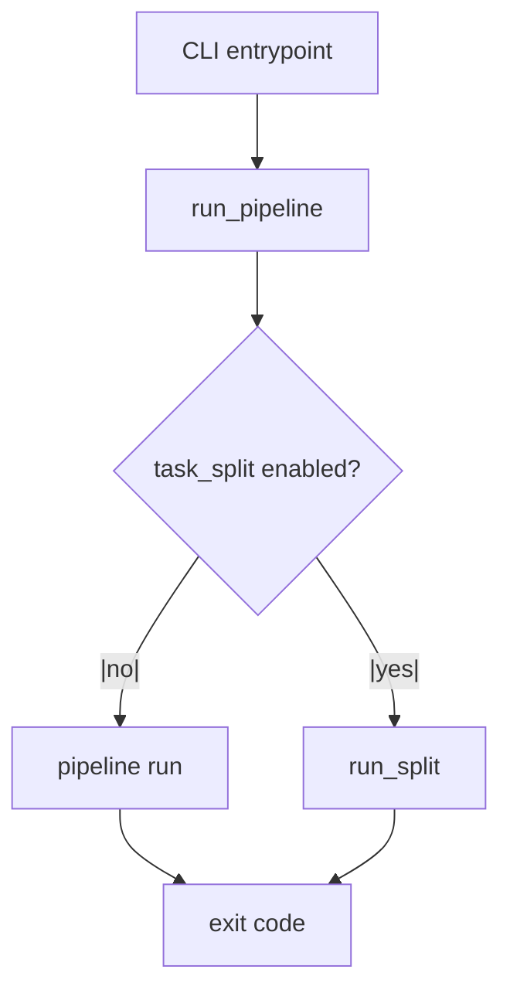
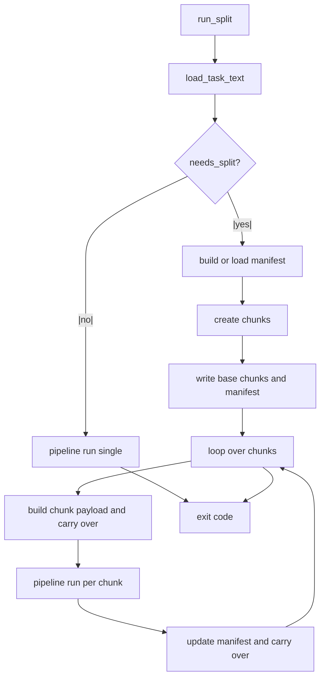
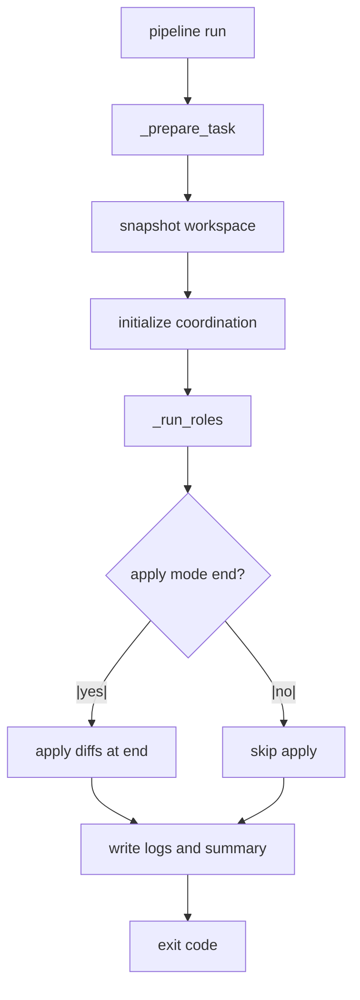
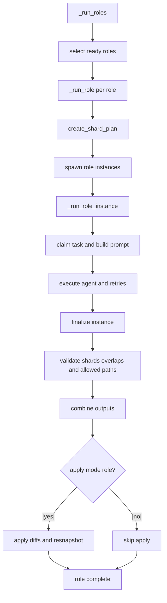
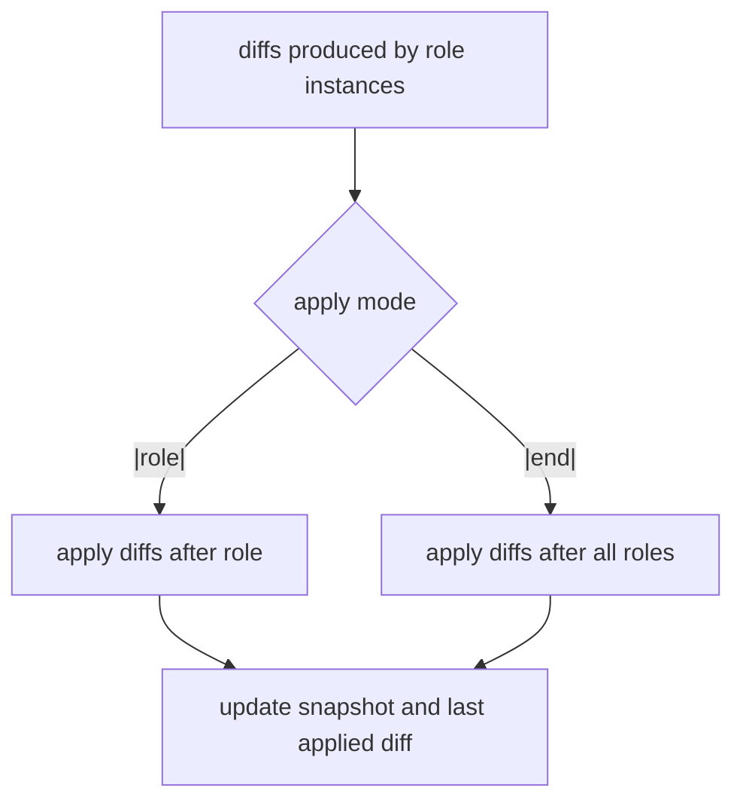

# Workflow Diagrams (Mermaid)

This document summarizes the most important runtime flows in the orchestrator
with Mermaid diagrams and short, implementation-focused notes.

## 1) Entry and Run Selection

Details:
- The CLI calls `run_pipeline`, which decides between a single run or task split.
- Task split is enabled via `--task-split` or `task_split.enabled`.
- Source: `multi_agent/run_helpers.py`

## 2) Task Split (Multi-Run Orchestration)

Details:
- Chunk creation uses heading-based splitting (config `heading_level`) and size limits.
- Optional LLM planning is used only if `task_split.llm_cmd` is set; otherwise it falls back.
- Each chunk run is a normal pipeline run with its own run id and output directory.
- Source: `multi_agent/run_helpers.py`, `multi_agent/task_split.py`

## 3) Pipeline Core Run

Details:
- `_prepare_task` normalizes inline or `@file` tasks and writes `task_full.*` if needed.
- Snapshot text is injected into the prompt context for all roles.
- Coordination writes task-board and log entries under `.multi_agent_runs/<run_id>/`.
- Source: `multi_agent/pipeline.py`

## 4) Role Execution and Sharding

Details:
- Sharding is per role and per run; it is not global.
- `headings` mode uses H1 sections; `files` mode infers allowed paths from task text.
- Shard validation uses diff extraction to detect overlaps and allowed path violations.
- Source: `multi_agent/pipeline.py`, `multi_agent/sharding.py`, `multi_agent/diff_utils.py`

## 5) Diff Application (Role or End)

Details:
- `apply_mode=role` applies diffs per role and refreshes the snapshot used by next roles.
- `apply_mode=end` defers all changes until the pipeline finishes.
- Source: `multi_agent/pipeline.py`, `multi_agent/diff_applier.py`
