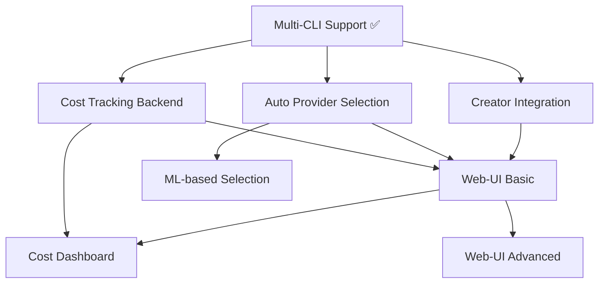

# Multi-CLI Extensions Roadmap

Erweiterungen für das Multi-CLI Provider Support Feature.

## Übersicht

Diese Erweiterungen bauen auf dem implementierten Multi-CLI Support auf und fügen fortgeschrittene Features für Automatisierung, Management und Monitoring hinzu.

## Features

### 1. Creator Scripts CLI-Provider Integration
**Status**: 📋 Geplant
**Priorität**: 🟢 Hoch
**Aufwand**: 2-3 Tage

Erweitert die NL-Creator Scripts (Family + Role Creator) um automatische CLI-Provider-Auswahl und -Konfiguration.

[→ Zur Dokumentation](01_creator_cli_integration/)

**Key Benefits**:
- Automatische Provider-Wahl beim Erstellen neuer Familien
- Intelligente Empfehlungen basierend auf Rollen-Typ
- CLI-Parameter-Generierung aus NL-Beschreibungen

---

### 2. Web-UI für Provider Management
**Status**: 📋 Geplant
**Priorität**: 🟡 Mittel
**Aufwand**: 5-7 Tage

Grafisches Interface für das Management von CLI-Providern, Konfigurationen und Monitoring.

[→ Zur Dokumentation](02_web_ui_provider_management/)

**Key Benefits**:
- Visuelle Provider-Konfiguration
- Echtzeit-Monitoring laufender Agents
- Interaktive Config-Bearbeitung
- Live-Preview von Änderungen

---

### 3. Automatische Provider-Auswahl
**Status**: 📋 Geplant
**Priorität**: 🟢 Hoch
**Aufwand**: 3-4 Tage

Intelligentes System zur automatischen Auswahl des optimalen CLI-Providers basierend auf Task-Komplexität, Kosten und Performance.

[→ Zur Dokumentation](03_auto_provider_selection/)

**Key Benefits**:
- Kostenoptimierung ohne manuelle Konfiguration
- Komplexitäts-Analyse von Tasks
- Adaptive Provider-Strategie
- A/B Testing verschiedener Provider

---

### 4. Cost Tracking Dashboard
**Status**: 📋 Geplant
**Priorität**: 🟡 Mittel
**Aufwand**: 4-5 Tage

Umfassendes Dashboard für Kosten-Tracking, Budget-Management und ROI-Analyse.

[→ Zur Dokumentation](04_cost_tracking_dashboard/)

**Key Benefits**:
- Echtzeit-Kostenübersicht
- Budget-Alerts
- Provider-Vergleich
- Export für Billing

---

## Implementierungs-Reihenfolge

### Phase 1: Foundation (Woche 1-2)
1. ✅ **Multi-CLI Support** (COMPLETED)
2. 📋 **Creator Scripts Integration**
3. 📋 **Auto Provider Selection (Core)**

### Phase 2: Intelligence (Woche 3-4)
4. 📋 **Auto Provider Selection (Advanced)**
5. 📋 **Cost Tracking (Backend)**

### Phase 3: UX (Woche 5-6)
6. 📋 **Web-UI (Basic)**
7. 📋 **Cost Dashboard**

### Phase 4: Polish (Woche 7-8)
8. 📋 **Web-UI (Advanced Features)**
9. 📋 **Integration Testing**
10. 📋 **Documentation & Examples**

---

## Technologie-Stack

### Backend
- **Core**: Python 3.11+
- **API Framework**: FastAPI (für Web-UI)
- **Async**: asyncio, aiohttp
- **Database**: SQLite (für Cost Tracking)
- **Message Queue**: Redis (optional, für Echtzeit-Updates)

### Frontend (Web-UI)
- **Framework**: React 18 + TypeScript
- **UI Library**: shadcn/ui + Tailwind CSS
- **State Management**: Zustand
- **Data Fetching**: TanStack Query
- **Charts**: Recharts
- **Real-time**: WebSockets (Socket.IO)

### Machine Learning (Auto Selection)
- **Framework**: scikit-learn
- **Features**: Task complexity scoring
- **Model**: Decision Tree / Random Forest
- **Training**: Historical run data

---

## Abhängigkeiten

---

## Kosten-Nutzen-Analyse

### Feature 1: Creator Integration
- **Aufwand**: 2-3 Tage
- **ROI**: ⭐⭐⭐⭐⭐
- **Grund**: Drastisch schnellere Config-Erstellung, weniger Fehler

### Feature 2: Web-UI
- **Aufwand**: 5-7 Tage
- **ROI**: ⭐⭐⭐
- **Grund**: Bessere UX, einfacheres Onboarding für non-technical users

### Feature 3: Auto Provider Selection
- **Aufwand**: 3-4 Tage
- **ROI**: ⭐⭐⭐⭐⭐
- **Grund**: 30-50% Kostenersparnis, keine manuelle Optimierung nötig

### Feature 4: Cost Dashboard
- **Aufwand**: 4-5 Tage
- **ROI**: ⭐⭐⭐⭐
- **Grund**: Budget-Kontrolle, ROI-Nachweis, Optimierungs-Insights

---

## Quick Wins

Wenn Zeit begrenzt ist, priorisiere diese Features:

1. **Creator Integration** (2-3 Tage) → Sofort produktiv
2. **Auto Provider Selection - Basic** (2 Tage) → 20-30% Kostenersparnis
3. **Cost Tracking - CLI** (1 Tag) → Budget-Transparenz

**Gesamt**: 5-6 Tage für maximalen Impact

---

## Langfristige Vision

### Year 1
- ✅ Multi-CLI Support
- 📋 Alle 4 Features implementiert
- 📋 Production-ready

### Year 2
- Multi-Provider Load Balancing
- Advanced ML-based Optimization
- Team Collaboration Features
- Enterprise SSO/Auth
- Audit Logs & Compliance

### Year 3
- Custom Provider Integration SDK
- Marketplace für Community Providers
- Advanced Analytics & Predictions
- Multi-Cloud Orchestration

---

## Getting Started

Jedes Feature hat ein eigenes Verzeichnis mit:

- **FEATURE.md** - Problem Statement & Goals
- **IMPLEMENTATION.md** - Technische Details & Architektur
- **EXAMPLES.md** - Code-Beispiele & Use Cases
- **TESTING.md** - Test-Strategie & QA

Beginne mit dem Feature deiner Wahl!
